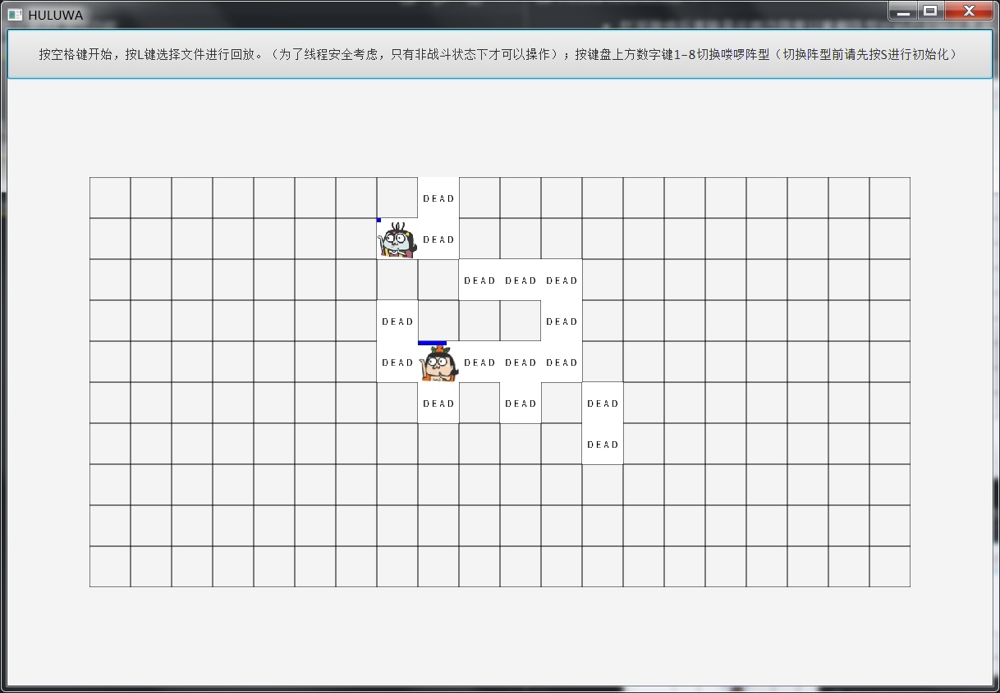

# 葫芦娃大战妖精实验报告

## 功能操作
- 按下空格键时战斗开始
- 按下‘L’键加载之前的战斗,每次战斗结束记录都会自动保存在save.txt中
- 按下‘S’键重新进行初始化
- 按下键盘上方1-8数字键改变妖精一方的阵型
- 战斗结束后可以按下空格键直接开启新的战斗，或者按‘L’键加载之前的战斗。但不能直接切换阵型，如需切换阵型，请先按下‘S’键进行初始化，再执行切换阵型操作
- 需要注意：为了保证线程安全，不造成死锁等麻烦，一切操作只有在非战斗状态下才有效果，并且切换阵型操作只有在初始化界面才有效

## 战斗机制
- 游戏开始时每个生物都有100的初始血量，血量为0或以下时该生物死亡
- 在两个敌对生物相遇时会对对方展开攻击，攻击强度基于自身的血量而定，自身血量越少，攻击力越强，这样能更多的出现绝地反杀的情形，增加趣味性
- 所有生物会在敌方位置接近的情况下尽量向敌方移动并攻击，以免拖延战斗时长
- 生物死的位置会留下DEAD字样，并且令活着的生物不可跨越

## 界面说明
- 打开游戏后直接显示两边阵营以衝軛阵型对峙的初始化界面，并且界面上方有操作提示，显示画面如下：

- 在初始化界面中按下键盘上方的数字键1-8，即可将妖精一方的阵型改变，改阵型示例如下：

- 此时按下空格键即可开始战斗，战斗画面如下：

- 头像上有血条显示，若空血则死亡，死亡后会在位置上留下DEAD字样：

- 胜利界面如下：

- 按‘L’键后会弹出文件选择框，选择项目目录下的save.txt加载之前的战斗，界面如下：

## 程序设计

### UML类图

### 生物
所有的生物类都在Creatures包中，其中Creature是所有生物的基类，包含了位置，血量，名字等通用信息，还包含了一些通用的方法，如攻击，移动等等

### 战场
BattleField包中有所有关于战场的类，其中Space类是根据老师的建议，给每个生物在战场上分配一块空间，整个战场应该是由空间组成的。Field类是战场类，其中有一个由Sapce数组，Field类专门为战场服务，开辟战场，展示战场等都是Field类的任务。Battle类则是为战斗服务，其中开始战斗时的创建生物线程等等都属于Battle类的服务范围

### 后端控制
根据SRP（单一职责）原则，将后端控制独立成一个类，功能主要是将后端数据进行整理方便GUI工作，同时监听各种事件并对用户的操作做出相应的反应。

### 保存记录
由于战斗机制不是按照概率确定生死，而是根据血量和攻击的计算来决定生物的状态，所以只要生物在战斗时记住位置和血量，他们在回放过程中的状态就不会改变，而由于血量其实也和位置记录相关，所以只要存储了每轮每个生物的位置和动作，就能实现回放

### 多线程
战斗开始时给每个生物都分配了一个独立的线程，在它们死亡后线程也会随之结束；为了解决线程之间的同步问题，这里我使用了synchronized锁，在生物对目标进行攻击或移动时对目标上锁，这样就不会出现死锁活锁等问题了。还有一个GUIrefresh类是用来对GUI进行刷新的，这里也使用了synchronized锁，因为战场是public的，这样做可以保证战场上每个空间轮流被访问，保证了战场的安全。

## 面向对象基本特性

### 封装
封装是指一种将抽象性函式接口的实现细节部分包装、隐藏起来的方法。
封装可以被认为是一个保护屏障，防止该类的代码和数据被外部类定义的代码随机访问。要访问该类的代码和数据，必须通过严格的接口控制。
我的代码中每一个类都是一个数据与方法的封装，并且也都提供了必需的对外接口方便外部访问

### 继承
继承就是子类继承父类的特征和行为，使得子类对象具有父类的实例域和方法，或子类从父类继承方法，使得子类具有父类相同的行为。在我的代码中，Huluwa等生物类均继承于Creature类，因为所有生物的行为大多相同，所以大部分是实现继承，即无需续写代码的继承方式。

### 多态
多态是同一个行为具有多个不同表现形式或形态的能力，或者说就是同一个接口，使用不同的实例而执行不同操作。这点在我的代码中也有体现，在一些生物类的方法中，根据所传入生物的实例不同，会有不同的代码执行，比如在攻击方法attackEnemy()中就会对不同阵营的生物给出不同的攻击力加成。

## 设计原则

### Liskov替换原则
Liskov替换原则地中心思想就是任何基类出现的地方都应该可以无差别的使用子类替换。Liskov替换原则在我的代码中主要体现在所有使用Creature的地方用Creature的那些子类进行替换都是没有影响的

### SRP(单一职责)原则
单一职责原则的体现在上面类的介绍里有提到过，将每个类的职责分开，每个类只有一个变化的方式

### OCP（开放封闭）原则
开放封闭原则是所有面向对象原则的核心。软件设计本身所追求的目标就是封装变化、降低耦合，而开放封闭原则正是对这一目标的最直接体现。这一点在我的阵型改变方法中有体现，它对于扩展是开放的，但是对于修改是封闭的

## 机制

### 异常处理
代码中多处使用了异常处理机制，这让debug变得轻松了很多，catch到异常后能迅速定位bug并进行处理

### 集合类型
在实验中使用了集合类型用以存放各种生物，并将集合传入排列阵型的方法中进行阵型排列

### 泛型
泛型的本质是参数化类型，也就是说所操作的数据类型被指定为一个参数。我的代码中在Creature类上使用了泛型机制，使其中方法能被多种类型使用

### 注解
注解的本质就是一个继承了 Annotation 接口的接口，或者说注解就是一段代码的标签。注解在我的代码中的主要使用是在单元测试模块中，主要用到了@Test这个注解

### 输入输出
输入输出流根据数据流向的不同分为输入流和输出流，根据处理数据类型的不同分为字符流和字节流，输入输出在我的代码中主要任务是读入程序中需要的图片以及回放模块中读入战斗记录，输出战斗记录

